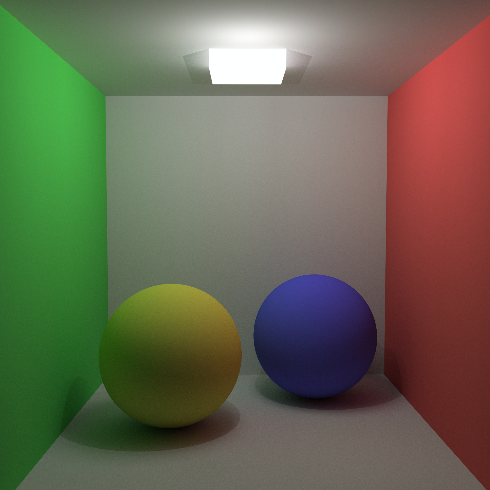
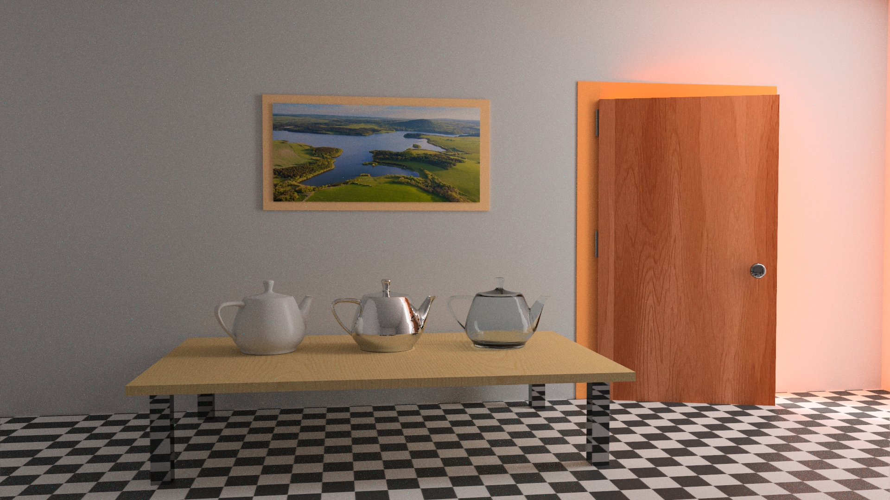

# ADVANCED RAY TRACER PROJECT

This project was implemented during Spring 2020-2021 for Advanced Ray Tracing course. We first started with basic intersections and got simple images but after a while, we have studied more advanced techniques and our rendering results got a lot realistic.

I first tried to implement this project with GLSL compute shaders but failed to follow the homeworks on time. So when I saw that it was tackling my progress, I immediately implemented a CPU version and carried on from there (This happened after 2nd Homework).

At the end of the semester, I have a **pet** ray tracer as a programmer :D. I want to thank to our professor Ahmet Oğuz Akyüz for this amazing course and also to my classmates (I've learnt a lot reading their blog posts).

Feature list:

- [x] Parallelism with C++ Async/Future
- [x] BVH trees for mesh intersections
- [x] Diffuse, Dielectric, Conductor materials
- [x] Multisampling
- [x] Motion Blur
- [x] Glossy Reflections
- [x] Depth Of Field
- [x] Texture support
- [x] Procedural Textures and Perlin Noise generator
- [x] Advanced Lighting (Directional, Point, Area, Environment, Spot lights)
- [x] HDR imaging and tone mapping
- [x] BRDF models
- [x] Object lights ( Light meshes and Light spheres)   
- [x] Path tracing support

During the course we recorded our progress with blog posts, mine is here : 

[My Blog Posts](https://erendere.wordpress.com/2021/05/15/raytracing-revisited/ "Eren Dere's blog")

| **Cornellbox scene with diffuse spheres** |
|:--:|
||
| *Rendered in approx. 3 hours* |

| **Veach Ajar Scene** |
|:--:|
||
| *Rendered in approx. 1 day 8 hours* |

